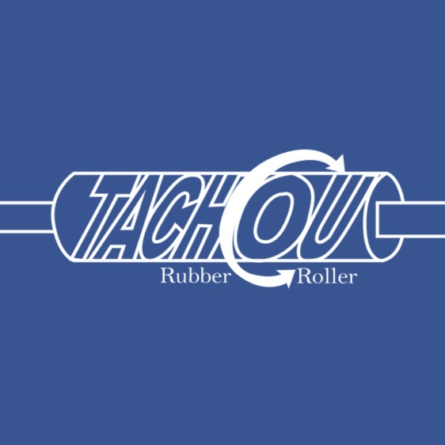

# Tachou Product Improvement System



## Introduction

Welcome to the prototype code for Tachou Rubber's Product Improvement System. This project was initiated to address product return issues in collaboration with the factory. Constructed primarily using Material UI, this comprehensive system offers insights into product return reasons and rework processes across various departments.

## Project Overview

- **Duration**: Oct 2022 - Jan 2023
- **Role**: Full Stack Developer
- **Technologies**: JavaScript, React.js, Firebase

## Key Achievements

- Led a 4-month project, collaborating closely with the factory to develop the Product Improvement System.
- Designed an intuitive dashboard that presents data collected from 5 different departments, offering insights into product return reasons and rework processes.
- Achieved a 50% reduction in product rework.
- Enhanced customer satisfaction by 20%.
- Realized a cost-saving of 20K AUD.
- Successfully communicated complex technical concepts to non-technical stakeholders in an understandable manner, ensuring clarity and alignment on project objectives and outcomes.

## Running the Prototype

1. Clone the repository and navigate to its directory.
2. Install the necessary dependencies:
\```
npm install
\```
3. Start the development server:
\```
npm start
\```
4. Open your browser and navigate to `localhost:3000`.

**Login Credentials**:
- **Username**: manager@tachou.com
- **Password**: 12345678

## Feedback & Contributions

Feel free to take a look around and provide feedback. Contributions, suggestions, and enhancements are always welcome!
